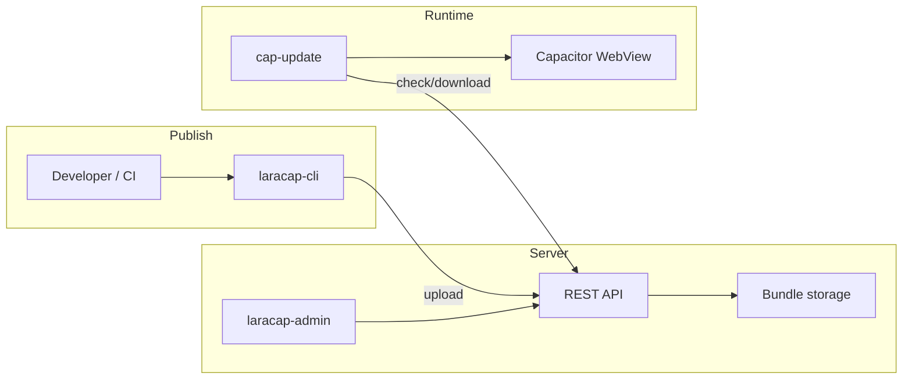

# LaraCap Overview

## What Is LaraCap?

LaraCap is an open-source, self-hosted web management panel for **Capacitor apps**. It provides over-the-air (OTA) live bundle updates — an alternative to commercial services like Ionic Appflow or Expo EAS where you own the entire infrastructure.

## Ecosystem

| Component | Repo | Role |
|-----------|------|------|
| **laracap-admin** | This repo | Nuxt admin + API (rebuild target) |
| **laracap-live-update** | Legacy | Laravel 12 + Filament v4 reference |
| **cap-update** | Client plugin | Capacitor native OTA (v8.x) |
| **laracap-cli** | CI tool | Bundle upload from terminal |

## Current Features (Legacy Laravel)

- **Application management** — Register Capacitor apps; data isolated by user ID
- **Channel routing** — Deploy to production, staging, beta streams
- **Bundle uploads** — ZIP web assets with version labels and retention limits
- **Native version constraints** — Target specific Android/iOS build numbers
- **Device fleet tracking** — Platform, location, current bundle on check-in
- **API tokens** — Sanctum tokens for CI/CD pipelines
- **Admin panel** — Filament v4 responsive UI

## Rebuild Goals

| Goal | Target |
|------|--------|
| Framework | Nuxt 4 full-stack |
| Admin UI | shadcn-vue + Tailwind |
| Deployment | Cloudflare Workers + Static Assets (single Worker, free tier) |
| Database | D1 (SQLite-compatible) |
| Storage | R2 for bundle ZIPs |
| API compat | **Strict** — no breaking changes for cap-update / laracap-cli |

## Multi-Tenancy Model

- Each **Application** belongs to one **User** (`user_id`)
- Non-admin users see only their own data
- **`is_admin`** flag grants global visibility and user management
- Teams/RBAC **not implemented** — `application_user` pivot table exists but unused

## Strict Compatibility Constraint

Public OTA endpoints and authenticated upload/auth endpoints **must not change**:

- Route paths, HTTP methods
- Request headers and JSON field names
- Response shapes and error messages
- Download headers `X-Bundle-Id`, `X-Bundle-Uuid`

See [adr/001-strict-api-compat.md](./adr/001-strict-api-compat.md).

## v1 Non-Goals (Document Only)

Do not implement in initial rebuild:

- Canary / phased rollouts (`rollout_percentage`)
- Webhooks (Slack, Discord)
- Team workspaces / RBAC
- S3 (use R2 instead)
- Changes to cap-update or laracap-cli

## Legacy README Discrepancies

The laracap-live-update README lists as "future":

- Client check/download API — **already implemented**
- CI/CD CLI — **already implemented** (laracap-cli)
- S3/CDN offloading — **planned for Nuxt/R2 rebuild**

## Documentation Map

Start at [docs/README.md](./README.md) for the full reading order and AI agent playbook.
