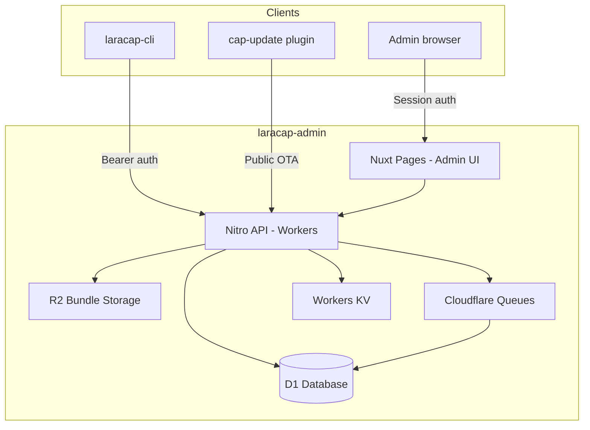
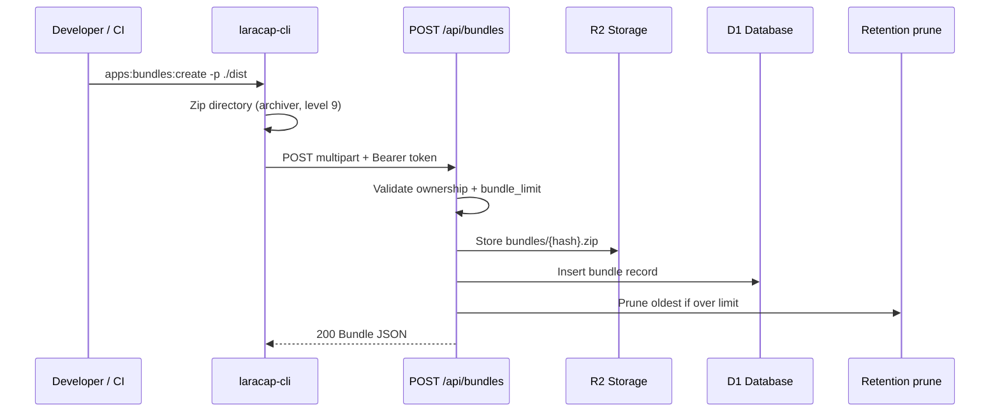
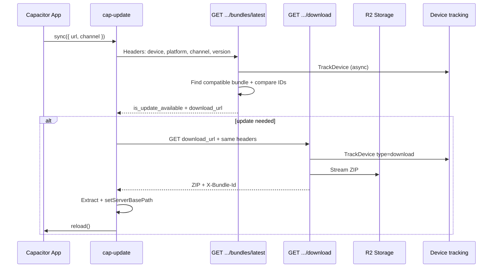
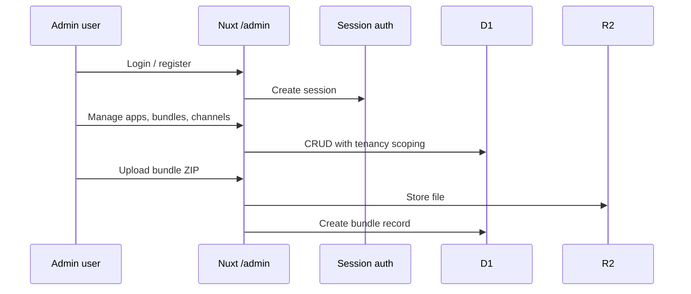

# System Architecture

End-to-end architecture for the LaraCap OTA stack.

## High-Level Architecture

## Publish Flow (Developer → Server)

### Steps

1. **Authenticate** — `POST /api/login` → bearer token (or use stored token / Filament-created token)
2. **Select app** — `GET /api/applications` or `--app-id`
3. **Upload** — `POST /api/bundles` with ZIP + optional channel + version constraints
4. **Retention** — Observer deletes oldest bundles beyond `bundle_limit`

## Runtime Flow (Device → Server)

### cap-update `sync()` decision logic

1. Call check endpoint
2. Proceed if `isUpdateAvailable` **OR** active bundle ≠ latest bundle ID
3. If bundle already cached locally → activate without re-download
4. Else download, extract to `cap_update_bundles/{id}/`, set server path, reload

See [04-ota-protocol.md](./04-ota-protocol.md).

## Admin Flow (Browser → Server)

Legacy Filament admin at `/admin` uses the same session as Breeze web auth.

## Three Auth Surfaces

| Surface | Used by | Mechanism |
|---------|---------|-----------|
| Public OTA | cap-update | No auth |
| Bearer API | laracap-cli | Sanctum-style token |
| Session | Admin UI | Cookie session |

See [07-auth-and-tenancy.md](./07-auth-and-tenancy.md).

## Laravel Legacy Stack (Reference)

| Layer | Technology |
|-------|------------|
| Framework | Laravel 12 |
| Admin | Filament v4 |
| API auth | Sanctum 4 |
| Web auth | Breeze 2 |
| Database | SQLite (default) |
| Queue | Database driver |
| Bundle storage | `public` disk |
| Device geo | ip-api.com + cache |

## Key Business Logic Components

| Component | Laravel path | Nuxt target |
|-----------|--------------|-------------|
| OTA check | `LatestAppBundleController` | `server/api/applications/[uuid]/bundles/latest.get.ts` |
| OTA download | `LatestAppBundleDownloadController` | `.../download.get.ts` |
| Bundle upload | `BundleController` | `server/api/bundles.post.ts` |
| Version constraints | `NativeVersionConstraintService` | `server/utils/nativeVersionConstraints.ts` |
| Device tracking | `TrackDeviceJob` | Queue consumer |
| Retention | `BundleObserver` | Post-create hook |
| Admin CRUD | `app/Filament/Resources/*` | `app/pages/admin/**/*.vue` |

## External Dependencies

| Service | Used for | Cloudflare replacement |
|---------|----------|------------------------|
| ip-api.com | Device geolocation | KV cache + optional CF headers |
| Git pull (sync-update) | Admin self-update | Cloudflare deploy hook |

## Health Check

Laravel exposes `GET /up` — consider equivalent health endpoint in Nuxt rebuild.
