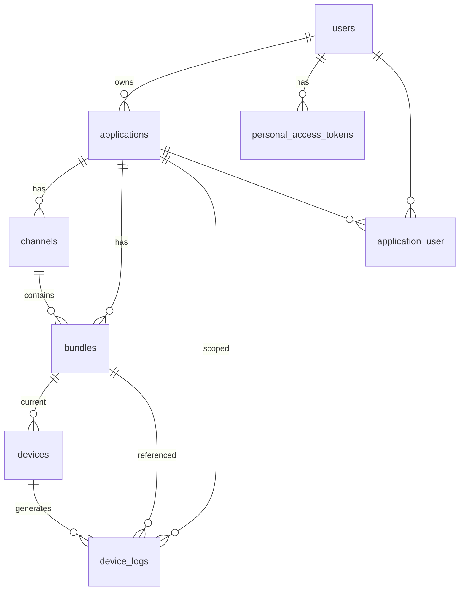

# Data Model

Database schema extracted from [laracap-live-update/database/migrations/](https://github.com/novalbayusetiawan/laracap-live-update/tree/main/database/migrations). Target: **Cloudflare D1** via Drizzle ORM (see [adr/003-d1-schema.md](./adr/003-d1-schema.md)).

## Entity Relationship Diagram



**Note:** `application_user` pivot exists in migrations but has **no Eloquent relationship or usage** — reserved for future teams/RBAC.

## Route Keys

| Model | Route binding key | Used by |
|-------|-------------------|---------|
| Application | `uuid` | Public OTA URLs `/api/applications/{uuid}/...` |
| Bundle, Channel, Device, User | numeric `id` | Admin UI, CLI `--app-id`, download headers |

## Domain Tables

### users

| Column | Type | Nullable | Default | Notes |
|--------|------|----------|---------|-------|
| id | BIGINT PK | NO | auto | |
| name | VARCHAR(255) | NO | — | |
| email | VARCHAR(255) | NO | — | UNIQUE |
| email_verified_at | TIMESTAMP | YES | NULL | |
| password | VARCHAR(255) | NO | — | bcrypt hashed |
| is_admin | BOOLEAN | NO | false | Gates UserResource, sync-update |
| remember_token | VARCHAR(100) | YES | NULL | |
| created_at | TIMESTAMP | YES | NULL | |
| updated_at | TIMESTAMP | YES | NULL | |

### applications

| Column | Type | Nullable | Default | Notes |
|--------|------|----------|---------|-------|
| id | BIGINT PK | NO | auto | CLI `--app-id` |
| uuid | UUID/CHAR(36) | NO | — | UNIQUE; auto-generated on create |
| name | VARCHAR(255) | NO | — | |
| slug | VARCHAR(255) | NO | — | UNIQUE |
| description | VARCHAR(255) | YES | NULL | |
| bundle_limit | INT | YES | NULL | Retention cap; null = unlimited |
| user_id | BIGINT FK | YES | NULL | → users.id ON DELETE CASCADE |
| created_at | TIMESTAMP | YES | NULL | |
| updated_at | TIMESTAMP | YES | NULL | |

### channels

| Column | Type | Nullable | Default | Notes |
|--------|------|----------|---------|-------|
| id | BIGINT PK | NO | auto | |
| uuid | UUID/CHAR(36) | NO | — | UNIQUE |
| application_id | BIGINT FK | NO | — | → applications.id CASCADE |
| name | VARCHAR(255) | NO | — | **No unique constraint per app** |
| created_at | TIMESTAMP | YES | NULL | |
| updated_at | TIMESTAMP | YES | NULL | |

### bundles

| Column | Type | Nullable | Default | Notes |
|--------|------|----------|---------|-------|
| id | BIGINT PK | NO | auto | Sent in X-Bundle-Id |
| uuid | UUID/CHAR(36) | NO | — | UNIQUE; sent in download header |
| name | VARCHAR(255) | YES | NULL | Version label |
| description | VARCHAR(255) | YES | NULL | |
| size | DOUBLE(8,2) | NO | — | Bytes |
| file_path | VARCHAR(255) | NO | — | R2 key in rebuild (e.g. `bundles/xxx.zip`) |
| application_id | BIGINT FK | NO | — | → applications.id CASCADE |
| channel_id | BIGINT FK | YES | NULL | → channels.id SET NULL |
| android_min_version_code | INT UNSIGNED | YES | NULL | |
| android_max_version_code | INT UNSIGNED | YES | NULL | |
| android_eq_version_code | INT UNSIGNED | YES | NULL | Exclude exact match |
| ios_min_version_code | INT UNSIGNED | YES | NULL | |
| ios_max_version_code | INT UNSIGNED | YES | NULL | |
| ios_eq_version_code | INT UNSIGNED | YES | NULL | Exclude exact match |
| created_at | TIMESTAMP | YES | NULL | `latest()` = newest created_at |
| updated_at | TIMESTAMP | YES | NULL | |

### devices

| Column | Type | Nullable | Default | Notes |
|--------|------|----------|---------|-------|
| id | BIGINT PK | NO | auto | |
| device_identifier | UUID/CHAR(36) | NO | — | UNIQUE; from X-Device-Identifier |
| platform | VARCHAR(255) | YES | NULL | ios, android, web |
| bundle_id | BIGINT FK | YES | NULL | → bundles.id SET NULL |
| last_active_at | TIMESTAMP | YES | NULL | |
| created_at | TIMESTAMP | YES | NULL | |
| updated_at | TIMESTAMP | YES | NULL | |

### device_logs

| Column | Type | Nullable | Default | Notes |
|--------|------|----------|---------|-------|
| id | BIGINT PK | NO | auto | |
| device_id | BIGINT FK | NO | — | → devices.id CASCADE |
| application_id | BIGINT FK | YES | NULL | → applications.id SET NULL |
| bundle_id | BIGINT FK | YES | NULL | → bundles.id SET NULL |
| ip_address | VARCHAR(45) | YES | NULL | |
| user_agent | TEXT | YES | NULL | |
| country | VARCHAR(255) | YES | NULL | From ip-api.com |
| city | VARCHAR(255) | YES | NULL | |
| os_version | VARCHAR(255) | YES | NULL | Parsed from UA |
| device_model | VARCHAR(255) | YES | NULL | Parsed from UA |
| type | VARCHAR(255) | NO | `'check'` | `check` or `download` |
| created_at | TIMESTAMP | YES | NULL | |
| updated_at | TIMESTAMP | YES | NULL | |

### personal_access_tokens (Sanctum)

| Column | Type | Nullable | Default | Notes |
|--------|------|----------|---------|-------|
| id | BIGINT PK | NO | auto | |
| tokenable_type | VARCHAR | NO | — | Morph; `App\Models\User` |
| tokenable_id | BIGINT | NO | — | Morph index |
| name | VARCHAR(255) | NO | — | e.g. `api-token` |
| token | VARCHAR(64) | NO | — | UNIQUE; hashed |
| plain_text_token | VARCHAR(255) | YES | NULL | **Custom column** for Filament copy UI |
| abilities | TEXT | YES | NULL | JSON; default `["*"]` |
| last_used_at | TIMESTAMP | YES | NULL | |
| expires_at | TIMESTAMP | YES | NULL | |
| created_at | TIMESTAMP | YES | NULL | |
| updated_at | TIMESTAMP | YES | NULL | |

### application_user (unused pivot)

| Column | Type | Nullable | Notes |
|--------|------|----------|-------|
| id | BIGINT PK | NO | |
| application_id | BIGINT FK | NO | CASCADE |
| user_id | BIGINT FK | NO | CASCADE |
| created_at | TIMESTAMP | YES | |
| updated_at | TIMESTAMP | YES | |

No unique on `(application_id, user_id)`.

## Infrastructure Tables

Required for Laravel parity; adapt for Cloudflare where noted.

| Table | Laravel use | Cloudflare target |
|-------|-------------|-------------------|
| sessions | Filament/Breeze session auth | D1 sessions table |
| password_reset_tokens | Breeze password reset | D1 |
| cache, cache_locks | ip-api geo cache | Workers KV |
| jobs, job_batches, failed_jobs | TrackDeviceJob queue | Cloudflare Queues |
| migrations | Laravel meta | Drizzle migrations |

## SQL-Ready DDL (Domain Tables)

```sql
CREATE TABLE users (
    id INTEGER PRIMARY KEY AUTOINCREMENT,
    name TEXT NOT NULL,
    email TEXT NOT NULL UNIQUE,
    email_verified_at TEXT NULL,
    password TEXT NOT NULL,
    is_admin INTEGER NOT NULL DEFAULT 0,
    remember_token TEXT NULL,
    created_at TEXT NULL,
    updated_at TEXT NULL
);

CREATE TABLE applications (
    id INTEGER PRIMARY KEY AUTOINCREMENT,
    uuid TEXT NOT NULL UNIQUE,
    name TEXT NOT NULL,
    slug TEXT NOT NULL UNIQUE,
    description TEXT NULL,
    bundle_limit INTEGER NULL,
    user_id INTEGER NULL REFERENCES users(id) ON DELETE CASCADE,
    created_at TEXT NULL,
    updated_at TEXT NULL
);

CREATE TABLE channels (
    id INTEGER PRIMARY KEY AUTOINCREMENT,
    uuid TEXT NOT NULL UNIQUE,
    application_id INTEGER NOT NULL REFERENCES applications(id) ON DELETE CASCADE,
    name TEXT NOT NULL,
    created_at TEXT NULL,
    updated_at TEXT NULL
);

CREATE TABLE bundles (
    id INTEGER PRIMARY KEY AUTOINCREMENT,
    uuid TEXT NOT NULL UNIQUE,
    name TEXT NULL,
    description TEXT NULL,
    size REAL NOT NULL,
    file_path TEXT NOT NULL,
    application_id INTEGER NOT NULL REFERENCES applications(id) ON DELETE CASCADE,
    channel_id INTEGER NULL REFERENCES channels(id) ON DELETE SET NULL,
    android_min_version_code INTEGER NULL,
    android_max_version_code INTEGER NULL,
    android_eq_version_code INTEGER NULL,
    ios_min_version_code INTEGER NULL,
    ios_max_version_code INTEGER NULL,
    ios_eq_version_code INTEGER NULL,
    created_at TEXT NULL,
    updated_at TEXT NULL
);

CREATE TABLE devices (
    id INTEGER PRIMARY KEY AUTOINCREMENT,
    device_identifier TEXT NOT NULL UNIQUE,
    platform TEXT NULL,
    bundle_id INTEGER NULL REFERENCES bundles(id) ON DELETE SET NULL,
    last_active_at TEXT NULL,
    created_at TEXT NULL,
    updated_at TEXT NULL
);

CREATE TABLE device_logs (
    id INTEGER PRIMARY KEY AUTOINCREMENT,
    device_id INTEGER NOT NULL REFERENCES devices(id) ON DELETE CASCADE,
    application_id INTEGER NULL REFERENCES applications(id) ON DELETE SET NULL,
    bundle_id INTEGER NULL REFERENCES bundles(id) ON DELETE SET NULL,
    ip_address TEXT NULL,
    user_agent TEXT NULL,
    country TEXT NULL,
    city TEXT NULL,
    os_version TEXT NULL,
    device_model TEXT NULL,
    type TEXT NOT NULL DEFAULT 'check',
    created_at TEXT NULL,
    updated_at TEXT NULL
);

CREATE TABLE personal_access_tokens (
    id INTEGER PRIMARY KEY AUTOINCREMENT,
    tokenable_type TEXT NOT NULL,
    tokenable_id INTEGER NOT NULL,
    name TEXT NOT NULL,
    token TEXT NOT NULL UNIQUE,
    plain_text_token TEXT NULL,
    abilities TEXT NULL,
    last_used_at TEXT NULL,
    expires_at TEXT NULL,
    created_at TEXT NULL,
    updated_at TEXT NULL
);
```

## Eloquent Relationships (reference)

```
User hasMany Application
User morphMany PersonalAccessToken (Sanctum)

Application belongsTo User
Application hasMany Bundle, Channel
Application hasOne latestBundle (latestOfMany)

Channel belongsTo Application
Channel hasMany Bundle

Bundle belongsTo Application, Channel
Bundle hasMany Device

Device belongsTo Bundle
Device hasOne latestLog (DeviceLog, latestOfMany)

DeviceLog belongsTo Device, Application, Bundle
```

## Model Serialization (API JSON)

Responses use **raw model serialization** — no API Resources/transformers. All columns above plus `created_at` / `updated_at` appear in JSON with **snake_case** keys.

### Bundle JSON example

```json
{
  "id": 42,
  "uuid": "550e8400-e29b-41d4-a716-446655440000",
  "name": "v1.2.0",
  "description": null,
  "size": 1048576,
  "file_path": "bundles/abc123.zip",
  "application_id": 1,
  "channel_id": 2,
  "android_min_version_code": null,
  "android_max_version_code": null,
  "android_eq_version_code": null,
  "ios_min_version_code": null,
  "ios_max_version_code": null,
  "ios_eq_version_code": null,
  "created_at": "2026-06-13T05:54:19.000000Z",
  "updated_at": "2026-06-13T05:54:19.000000Z"
}
```

## Factories (testing reference)

| Factory | Defaults | Caveat |
|---------|----------|--------|
| UserFactory | password = `password` | `is_admin` not set (false) |
| ApplicationFactory | nested User | `bundle_limit` null |
| ChannelFactory | name from production/staging/development | |
| BundleFactory | nested Application + Channel | **Creates mismatched app/channel unless overridden** |

Tests always override `application_id` and `channel_id` to the same application.
