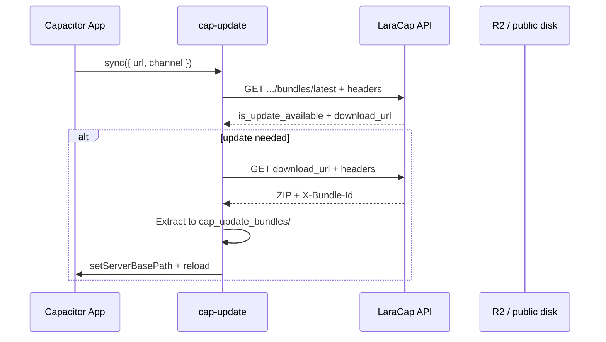

# OTA Protocol — cap-update Integration

How the **cap-update** Capacitor plugin (v8.x) communicates with the LaraCap server. The plugin does **not** enforce version constraints locally — all filtering is server-side.

Related: [cap-update README](https://github.com/novalbayusetiawan/cap-update), [CHANNEL_SWITCHING.md](https://github.com/novalbayusetiawan/cap-update/blob/main/docs/CHANNEL_SWITCHING.md)

## Stack Role



## Plugin Configuration

No `capacitor.config` plugin block. Runtime options per call:

| Option | Methods | Default | Description |
|--------|---------|---------|-------------|
| `url` | `sync`, `checkForUpdate` | required | Check endpoint URL |
| `channel` | `sync`, `checkForUpdate` | `'production'` | Must match server channel name |
| `bundleId` | `downloadBundle`, `setBundle` | auto | From URL/header if omitted |
| `checksum` | `downloadBundle` | none | SHA-256; not used in `sync()` |
| `immediate` | `setBundle`, `reset` | false | Reload WebView immediately |

Example:

```typescript
await CapUpdate.sync({
  url: 'https://your-server.com/api/applications/{app-uuid}/bundles/latest',
  channel: 'production',
});
```

## Request Headers (Native)

Sent on both **check** and **download** requests.

| Header | iOS source | Android source | Server reads |
|--------|-----------|----------------|--------------|
| `X-Device-Identifier` | `identifierForVendor` | `ANDROID_ID` | Device tracking |
| `X-Platform` | `"ios"` | `"android"` | Platform + constraint selection |
| `X-Bundle-Id` | Active bundle ID or `""` | Same | Global active bundle |
| `X-Channel` | `channel` param | Same | Channel lookup |
| `X-Channel-Bundle-Id` | Per-channel prefs map | `channel_bundle_{channel}` | Channel-specific comparison |
| `X-App-Version-Code` | `CFBundleVersion` | `PackageInfo.versionCode` | Native version constraints |

**Web stub** sends `X-Platform: web` only — no version code header.

## Channel Switching Logic

### Problem

A device may run staging bundle ID `8` while checking the `production` channel (latest ID `5`). Comparing global `X-Bundle-Id` would incorrectly report "update available."

### Solution

Server compares **per-channel** bundle ID:

```
channelBundleId = channel_bundle_id ?? X-Channel-Bundle-Id ?? X-Bundle-Id
is_update_available = latest.id !== channelBundleId  (when latest exists)
```

### Scenarios

| Device state | Headers | Result |
|--------------|---------|--------|
| Never synced production | `X-Channel-Bundle-Id` missing, on prod channel | Update available |
| Already on prod latest | `X-Channel-Bundle-Id` = latest prod id | No update |
| Running staging, checking prod | Global id = staging, channel id = prod latest | No update (if channel id matches) |
| Server rollback | Latest id decreased | Update available (`!==` detects downgrade) |

### Plugin persistence

| Platform | Storage key |
|----------|-------------|
| iOS | `cap_update_channel_bundles` dict in UserDefaults |
| Android | `channel_bundle_{channel}` in SharedPreferences |

## Native Version Constraints

### Semantics (Capawesome-aligned)

| Field | Rule |
|-------|------|
| `*_min_version_code` | Client version must be **≥ min** |
| `*_max_version_code` | Client version must be **≤ max** |
| `*_eq_version_code` | Client version must **NOT equal** eq (exclude exact native build) |

**Unconstrained bundle:** all 6 fields null → any device eligible, no version header required.

**Constrained bundle:** if any platform field set and client sends no `X-App-Version-Code` → **incompatible**.

**Web platform:** constraints skipped entirely.

### Compatibility algorithm

```javascript
function isCompatible(bundle, platform, versionCode) {
  if (!['android', 'ios'].includes(platform)) return true
  if (!hasNativeVersionConstraints(bundle, platform)) return true
  if (versionCode === null) return false

  const fields = platform === 'android'
    ? ['android_min_version_code', 'android_max_version_code', 'android_eq_version_code']
    : ['ios_min_version_code', 'ios_max_version_code', 'ios_eq_version_code']

  const [min, max, eq] = fields.map(f => bundle[f])
  if (min !== null && versionCode < min) return false
  if (max !== null && versionCode > max) return false
  if (eq !== null && versionCode === eq) return false
  return true
}
```

### Latest bundle selection

```javascript
function findLatestCompatibleBundle(channel, platform, versionCode) {
  const bundles = channel.bundles.orderBy('created_at', 'desc').all()
  return bundles.find(b => isCompatible(b, platform, versionCode)) ?? null
}
```

Walks newest-first; allows older bundles to serve devices excluded from the newest upload.

## Plugin `sync()` Decision Tree

1. Call check endpoint with headers
2. Proceed if `isUpdateAvailable` **OR** active bundle ID ≠ latest bundle ID (channel switch)
3. If bundle already on disk → activate without re-download
4. Else download from `download_url` with same headers
5. Extract ZIP → `cap_update_bundles/{id}/`
6. `bridge.setServerBasePath(path)` + optional reload

## Download Response

Server must return:

- Binary ZIP body
- Header `X-Bundle-Id` — used when plugin has no explicit bundleId
- Header `X-Bundle-Uuid` — informational

## OTA Mechanism (Native)

Uses Capacitor `Bridge.setServerBasePath()` — no local HTTP server.

| Platform | Built-in assets | OTA location |
|----------|-----------------|--------------|
| iOS | `Bundle.main/.../public` | `{Documents}/cap_update_bundles/{id}/` |
| Android | `public` asset path | `{filesDir}/cap_update_bundles/{id}/` |

Web root discovery: recursively find directory containing `index.html`.

## Plugin API Reference (not implemented in Nuxt)

| Method | Purpose |
|--------|---------|
| `sync({ url, channel })` | Check → download → apply → reload |
| `checkForUpdate({ url, channel })` | Check only |
| `downloadBundle({ url, bundleId?, checksum? })` | Manual download |
| `setBundle({ bundleId, immediate? })` | Activate downloaded bundle |
| `getBundle()` | Current active bundle |
| `getBundles()` | List local bundles |
| `deleteBundle({ bundleId })` | Remove non-active bundle |
| `reset({ immediate? })` | Revert to built-in assets |
| `reload()` | Reload WebView |
