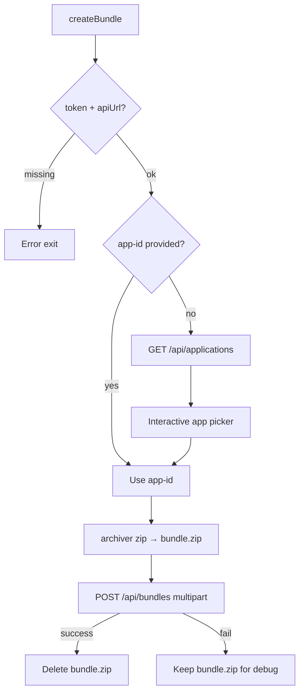

# CLI Integration — laracap-cli Contract

How **laracap-cli** v1.x authenticates and uploads bundles. Source: [laracap-cli](https://github.com/novalbayusetiawan/laracap-cli)

## Installation

```bash
npm install -g laracap-cli
# or
npx laracap-cli <command>
```

Entry point: `bin/laracap.js` (Commander v11). Package version: **1.0.4** (CLI `--version` may show stale `1.0.0`).

## Commands

| Command | Description | Options |
|---------|-------------|---------|
| `login` | Interactive email/password auth | — |
| `logout` | Revoke token, clear local config | — |
| `config:server-url` | Save server base URL | Interactive prompt |
| `apps:bundles:create` | Zip directory and upload | See below |

### `apps:bundles:create` flags

| Flag | Form field | Description |
|------|------------|-------------|
| `-p, --path <path>` | — | Directory to zip (default: `.`) |
| `-n, --name <name>` | `name` | Bundle release name |
| `-c, --channel <channel>` | `channel` | Channel name |
| `-s, --server <url>` | — | Override stored server URL |
| `-t, --token <token>` | — | API token (bypass stored token) |
| `-a, --app-id <appId>` | `application_id` | Target app id or UUID |
| `--android-min <code>` | `android_min_version_code` | Min Android versionCode |
| `--android-max <code>` | `android_max_version_code` | Max Android versionCode |
| `--android-eq <code>` | `android_eq_version_code` | Exclude exact versionCode |
| `--ios-min <code>` | `ios_min_version_code` | Min iOS CFBundleVersion |
| `--ios-max <code>` | `ios_max_version_code` | Max iOS CFBundleVersion |
| `--ios-eq <code>` | `ios_eq_version_code` | Exclude exact CFBundleVersion |

Bundles without version constraint fields are **unconstrained**.

## Config Storage

Uses [`conf`](https://www.npmjs.com/package/conf) v12:

```javascript
new Conf({
  projectName: 'laracap',
  defaults: {
    token: null,
    apiUrl: 'http://laracap-live-update.test/api', // BUG: includes /api
  },
});
```

### Storage locations

| OS | Path |
|----|------|
| macOS | `~/Library/Application Support/laracap/config.json` |
| Linux | `~/.config/laracap/config.json` |
| Windows | `%APPDATA%\laracap\config.json` |

### Config keys

| Key | Description |
|-----|-------------|
| `apiUrl` | Server **base** URL without trailing slash |
| `token` | Sanctum bearer token from login |

**Important:** CLI appends `/api/...` to `apiUrl`. Store base URL like `https://laracap.dev`, **not** `https://laracap.dev/api`.

## Authentication Flow

### Interactive

```bash
npx laracap config:server-url   # saves https://your-server.com
npx laracap login               # POST /api/login → saves token
npx laracap apps:bundles:create -p ./dist
npx laracap logout              # DELETE /api/logout
```

### CI / non-interactive

```bash
npx laracap apps:bundles:create \
  --path ./dist \
  --server https://laracap.dev \
  --token <your_api_token> \
  --app-id <application_id> \
  --channel production \
  --android-min 10 --android-max 12 --android-eq 11 \
  --ios-min 10 --ios-max 12 --ios-eq 11
```

Tokens can come from `login` or admin UI API token creation.

## API Endpoints Called

All paths: `{apiUrl}/api/...`

| Method | Endpoint | Auth | Used by |
|--------|----------|------|---------|
| POST | `/api/login` | None | `login` |
| DELETE | `/api/logout` | Bearer | `logout` |
| GET | `/api/applications` | Bearer | Interactive app picker |
| POST | `/api/bundles` | Bearer | `apps:bundles:create` |

**Not called by CLI:** check/download endpoints, `/api/user`.

## Upload Flow



### Zip format

- Library: `archiver`, zlib level 9
- Output: `{cwd}/bundle.zip`
- Contents: directory files at **zip root** (no wrapper folder)
- Source: `archive.directory(path, false)`

### Multipart payload

| Form field | Source |
|------------|--------|
| `file` | Read stream of `bundle.zip` |
| `application_id` | `--app-id` or interactive pick |
| `name` | `--name` |
| `channel` | `--channel` |
| `android_min_version_code` | `--android-min` |
| `android_max_version_code` | `--android-max` |
| `android_eq_version_code` | `--android-eq` |
| `ios_min_version_code` | `--ios-min` |
| `ios_max_version_code` | `--ios-max` |
| `ios_eq_version_code` | `--ios-eq` |

### Success response

HTTP **200** with full Bundle JSON (see [02-data-model.md](./02-data-model.md)).

## Version Constraint Semantics

| Flag | Platform metric | Semantics |
|------|-----------------|-----------|
| `--android-min` | Android `versionCode` | Device must be ≥ this |
| `--android-max` | Android `versionCode` | Device must be ≤ this |
| `--android-eq` | Android `versionCode` | Exact match **excluded** |
| `--ios-min` | iOS `CFBundleVersion` | Device must be ≥ this |
| `--ios-max` | iOS `CFBundleVersion` | Device must be ≤ this |
| `--ios-eq` | iOS `CFBundleVersion` | Exact match **excluded** |

## Known CLI Issues

| Issue | Impact |
|-------|--------|
| Default `apiUrl` includes `/api` | Produces `/api/api/login` unless corrected |
| `--version` shows 1.0.0 | package.json is 1.0.4 |
| No path existence check | Missing `--path` zips `.` silently |
| README says "Database ID" for `--app-id` | Server also accepts UUID |

## Nuxt Server Validation

Ensure POST `/api/bundles` accepts:

- Bearer token in `Authorization` header
- Both numeric id and UUID for `application_id`
- All 6 snake_case version constraint fields
- Exact 403 error message strings
- 422 for min > max validation
