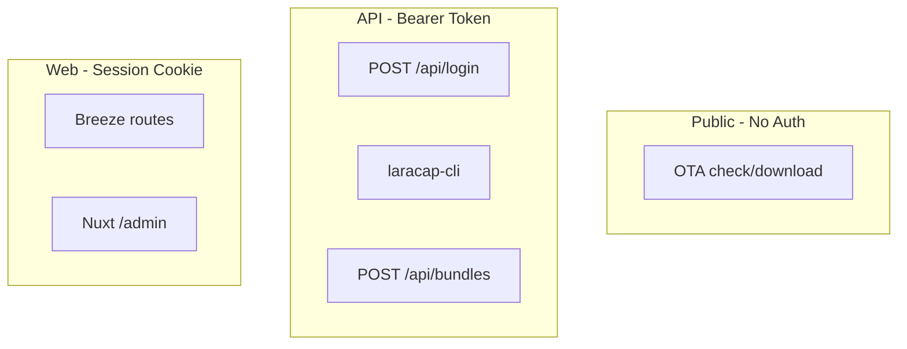

# Auth and Tenancy

> **Implementation note:** the admin session layer shipped with **`nuxt-auth-utils`**
> (sealed cookies), not Lucia. CLI/OTA uses Sanctum-compatible bearer tokens; `bcryptjs`
> for hashes. A **superadmin** role, a registration-lockdown **setting**, and
> **impersonation** were added beyond this spec. See
> [13-implementation-status.md](./13-implementation-status.md#3-auth-nuxt-auth-utils-not-lucia).

LaraCap uses **two separate auth systems** plus public OTA endpoints. No Laravel Policies — authorization is inline checks and query scoping.

## Auth Systems Overview



| System | Consumer | Mechanism | Storage |
|--------|----------|-----------|---------|
| Public | cap-update | None | — |
| Bearer API | laracap-cli | Sanctum personal access token | D1 tokens table |
| Session | Admin UI | Cookie session | D1 sessions table |

## API Token Auth (CLI)

### Login

`POST /api/login`

```json
{ "email": "user@example.com", "password": "password" }
```

Response:

```json
{ "token": "1|plainTextToken..." }
```

Token created with:
- Name: `api-token`
- Abilities: `['*']` (default)

### Authenticated requests

```
Authorization: Bearer {token}
```

### Logout

`DELETE /api/logout` — deletes **current** token only. Returns **204**.

### Token storage (legacy)

Sanctum stores hashed token in `personal_access_tokens.token`. Custom column `plain_text_token` added for Filament copy UI.

**Nuxt rebuild:** Store hash only; show plain token once on creation. Preserve login response shape for CLI compat.

### Admin token creation (Filament)

Via ApiTokenResource header CreateAction:

```php
Auth::user()->createToken($name, ['*'], $expiresAt);
// Saves plain_text_token for copy in admin UI
```

Options:
- Never expires (default toggle)
- Optional `expires_at` (min now + 1 minute)

## Session Auth (Admin UI)

### Breeze web routes

| Method | Path | Middleware | Response |
|--------|------|------------|----------|
| POST | `/register` | guest | 204 + auto-login |
| POST | `/login` | guest | 204 |
| POST | `/logout` | auth | 204 |
| POST | `/forgot-password` | guest | 200 `{ status }` |
| POST | `/reset-password` | guest | 200 `{ status }` |
| GET | `/verify-email/{id}/{hash}` | auth, signed, throttle | redirect |
| POST | `/email/verification-notification` | auth, throttle | 200 |

### Registration validation

| Field | Rules |
|-------|-------|
| name | required, string, max:255 |
| email | required, lowercase, email, max:255, unique:users |
| password | required, confirmed, Password::defaults() |

### Web login (`LoginRequest`)

| Field | Rules |
|-------|-------|
| email | required, string, email |
| password | required, string |

**Rate limiting:** 5 attempts per `Str::lower(email)|ip`

Errors:
- Bad credentials: `auth.failed` → "These credentials do not match our records."
- Throttle: `auth.throttle` → "Too many login attempts..."

### Filament panel access

`User::canAccessPanel()` returns **`true` for all authenticated users** — no panel-level restriction.

Registration enabled on Filament panel.

### Session config (legacy)

| Setting | Value |
|---------|-------|
| Driver | database (`sessions` table) |
| Lifetime | 120 minutes |
| Same site | lax |
| HTTP only | true |

Tests override to `array` driver.

## Sanctum Config (legacy)

| Setting | Value |
|---------|-------|
| Stateful domains | localhost + APP_URL + FRONTEND_URL host |
| Guard | web |
| Token expiration | null (global); per-token `expires_at` |
| SPA middleware | AuthenticateSession, EncryptCookies, ValidateCsrfToken |

API routes prepend `EnsureFrontendRequestsAreStateful` for SPA cookie auth (unused by CLI).

## CORS

```php
'paths' => ['*'],
'allowed_origins' => [env('FRONTEND_URL', 'http://localhost:3000')],
'supports_credentials' => true,
```

## Tenancy Model

### User → Application ownership

```
User hasMany Application (user_id)
```

All tenant scoping flows from `application.user_id`.

### Admin flag

`users.is_admin` boolean, default `false`.

| Feature | Requires admin |
|---------|----------------|
| UserResource (list/create) | Yes |
| Sync Update menu item | Yes |
| ApiToken user column/filter | Admin-only visibility |
| Global data visibility | Admin sees all records |

### Resource scoping rules

Implement in every admin query and API endpoint:

```typescript
function scopeApplications(user: User) {
  if (user.is_admin) return db.select().from(applications)
  return db.select().from(applications).where(eq(applications.user_id, user.id))
}
```

Same pattern for bundles (via application), channels, devices (via bundle.application), tokens (own only unless admin).

### Upload authorization

`BundleController` checks:

```php
$application = $request->user()->applications()->find($applicationId);
if (!$application) return 403;
```

No policy classes — replicate inline.

## Email Verification

`EnsureEmailIsVerified` middleware exists but **`User` does not implement `MustVerifyEmail`** — middleware is inert.

Verify email redirect uses `config('app.frontend_url')` — ensure env is set in Nuxt.

## Password Hashing

Laravel uses bcrypt via cast on User model. Migrated password hashes work with compatible verify function.

## Nuxt Rebuild Recommendations

| Area | Recommendation |
|------|----------------|
| Admin session | nuxt-auth-utils or Lucia + D1 |
| API tokens | Custom table matching Sanctum shape; hash at rest |
| Token display | Show-once modal; never store plain_text_token |
| CSRF | Required for admin form POSTs |
| is_admin middleware | Protect `/admin/users`, sync/redeploy actions |
| Registration | Keep enabled (Filament default) |
| bundle_limit null | Fix upload gate (see business rules doc) |

## Route Name Collision

Both web and API define route name `login`. Always use full paths:
- Web: `POST /login`
- API: `POST /api/login`
