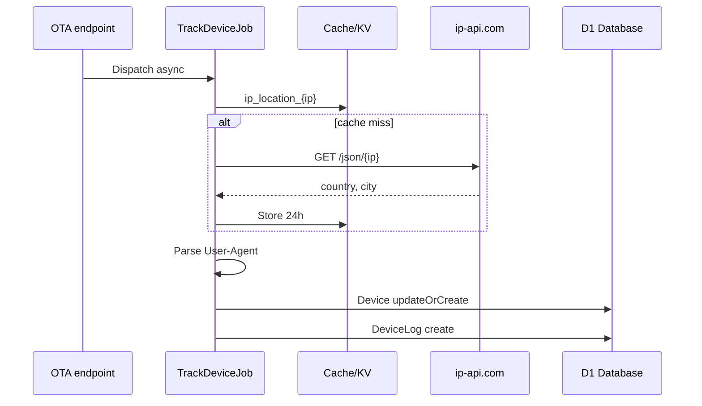

# Device Tracking

> **Implementation note:** this spec describes a Laravel-style queued `TrackDeviceJob`
> (Cloudflare Queues). The shipped system uses **`event.waitUntil()`** instead (Queues is
> paid; free-tier target). Same non-blocking outcome. See
> [13-implementation-status.md](./13-implementation-status.md#1-device-tracking-waituntil-not-cloudflare-queues).

Automatic fleet analytics when Capacitor devices check for updates or download bundles.

## Trigger Conditions

Device tracking runs when **both** are present on check or download requests:

- `device_identifier` / `X-Device-Identifier`
- `platform` / `X-Platform`

Implemented via `TracksDevice` trait → `TrackDeviceJob` (queued).

## Flow



## TrackDeviceJob Parameters

| Param | Source | Description |
|-------|--------|-------------|
| deviceIdentifier | Request header | UUID string |
| platform | Request header | ios, android, web |
| ip | `$request->ip()` | Client IP |
| ua | User-Agent header | Raw UA string |
| bundleId | Parsed from request | Current or latest bundle id |
| applicationId | Route application | Application numeric id |
| type | `'check'` or `'download'` | Log event type |

## Check Endpoint Tracking

From `LatestAppBundleController`:

1. Parse `bundle_id` as int if numeric
2. If bundle_id set but no DB row → null
3. Dispatch with `type = 'check'`, bundle_id from device state

## Download Endpoint Tracking

From `LatestAppBundleDownloadController`:

1. After resolving latest compatible bundle
2. Dispatch with `type = 'download'`, bundle_id = latest bundle id (or null)

## Geolocation

### ip-api.com lookup

```
GET http://ip-api.com/json/{ip}?fields=status,country,city
```

| Setting | Value |
|---------|-------|
| Cache key | `ip_location_{ip}` |
| Cache TTL | 86400 seconds (24h) |
| Rate limit | 40 requests per minute (`ip-api-lookup` limiter) |
| On rate limit | Job released back to queue, retry in 60 seconds |
| Skip IPs | `127.0.0.1`, `::1` |

On failure: log warning, continue without geo data.

## User-Agent Parsing

Regex on first `(…)` group in UA:

- **Android OS:** part containing "Android"
- **Device model:** part containing "Build/" — text before "Build/", first word only

Stored in `device_logs.os_version` and `device_logs.device_model`.

## Database Updates

### Device upsert

```php
Device::updateOrCreate(
    ['device_identifier' => $deviceIdentifier],
    [
        'platform' => $platform,
        'bundle_id' => $bundleId,
        'last_active_at' => now(),
    ]
);
```

### DeviceLog create

| Field | Value |
|-------|-------|
| device_id | From upsert |
| application_id | From request |
| bundle_id | From tracking param |
| ip_address | Client IP |
| user_agent | Full UA |
| country, city | From geo lookup |
| os_version, device_model | From UA parse |
| type | `check` or `download` |

## Device Model

```php
Device belongsTo Bundle
Device hasOne latestLog (DeviceLog, latestOfMany)
```

Admin UI shows `latestLog` for IP, location; computed columns for display.

## Queue Configuration

Legacy:
- Driver: `database` (default)
- Table: `jobs`
- Tests: `QUEUE_CONNECTION=sync`

## Cloudflare Implementation

| Laravel | Cloudflare |
|---------|------------|
| TrackDeviceJob queue | Cloudflare Queues or `event.waitUntil()` |
| Cache ip_location | Workers KV |
| ip-api.com | Same API with KV cache; optional `CF-IPCountry` fallback |
| Rate limit | KV counter or Durable Object |

Suggested queue message:

```typescript
interface DeviceTrackMessage {
  deviceIdentifier: string
  platform: string
  ip: string | null
  userAgent: string | null
  bundleId: number | null
  applicationId: number
  type: 'check' | 'download'
}
```

## Admin UI (DeviceResource)

Read-only fleet view at `/admin/devices`:

- Platform badges: ios=gray, android=green, web=blue
- Location from latest log city/country
- Filters: application, channel, platform, bundle
- No create action — devices created by API only

## Dashboard Analytics Using Device Data

| Widget | Query |
|--------|-------|
| Active Devices stat | Device count (scoped) |
| ActiveUsersChart | DeviceLog distinct device_id per day, 30 days |
| PlatformDistributionChart | Device group by platform |
| DeviceLocationChart | DeviceLog group by city/country, top 10 |

## Not Tested in Legacy

No Pest tests cover device tracking or DeviceLog creation. Add in Nuxt rebuild (see [11-test-matrix.md](./11-test-matrix.md)).
