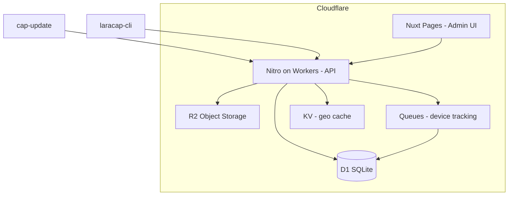
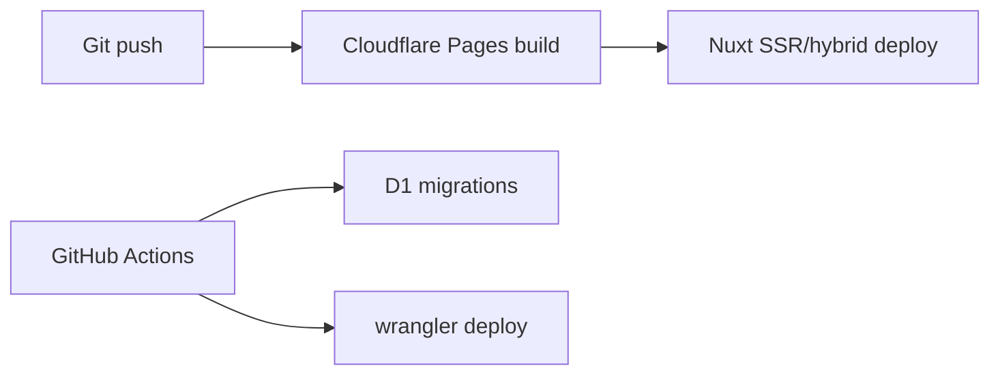

# Cloudflare Architecture

Target deployment stack for **laracap-admin** on Cloudflare's free tier.

## Component Mapping



| Laravel (legacy) | Cloudflare target |
|------------------|-------------------|
| SQLite / MySQL | **D1** |
| `storage/app/public/bundles/` | **R2** |
| Database queue (`jobs` table) | **Cloudflare Queues** |
| Database cache (ip-api) | **Workers KV** |
| Filament admin | **Nuxt + shadcn-vue** |
| Sanctum tokens | D1 `personal_access_tokens` table |
| Session auth (database) | D1 `sessions` + encrypted cookies |
| `storage:link` downloads | Worker streams from R2 |

See ADRs: [001](./adr/001-strict-api-compat.md), [002](./adr/002-r2-bundle-storage.md), [003](./adr/003-d1-schema.md).

## Recommended Nuxt Stack

| Package | Purpose |
|---------|---------|
| Nuxt 4 | Full-stack framework |
| `@nuxthub/core` or Nitro `cloudflare-module` | Cloudflare preset |
| shadcn-vue | Admin UI components |
| Tailwind CSS v4 | Styling |
| Drizzle ORM | D1 queries |
| `@cloudflare/vitest-pool-workers` | API route tests |

## Project Structure (Target)

```
laracap-admin/
├── app/
│   ├── pages/admin/           # shadcn admin pages
│   ├── components/admin/      # Dashboard widgets, forms
│   └── layouts/admin.vue
├── server/
│   ├── api/                   # Nitro routes (mirror Laravel api.php)
│   ├── database/
│   │   └── schema.ts          # Drizzle definitions
│   ├── utils/
│   │   ├── nativeVersionConstraints.ts
│   │   ├── bundleRetention.ts
│   │   └── auth.ts
│   └── middleware/
│       └── auth.ts
├── drizzle/
│   └── migrations/
├── nuxt.config.ts
└── wrangler.toml
```

## wrangler.toml Bindings (Stub)

```toml
name = "laracap-admin"
compatibility_date = "2024-01-01"

[[d1_databases]]
binding = "DB"
database_name = "laracap"
database_id = "<fill-on-create>"

[[r2_buckets]]
binding = "BUNDLES"
bucket_name = "laracap-bundles"

[[kv_namespaces]]
binding = "CACHE"
id = "<fill-on-create>"

[[queues.producers]]
binding = "DEVICE_QUEUE"
queue = "device-tracking"
```

## API Route Mapping

| Laravel route | Nitro file |
|---------------|------------|
| `GET /api/applications/{uuid}/bundles/latest` | `server/api/applications/[uuid]/bundles/latest.get.ts` |
| `GET .../download` | `server/api/applications/[uuid]/bundles/latest/download.get.ts` |
| `POST /api/bundles` | `server/api/bundles.post.ts` |
| `POST /api/login` | `server/api/login.post.ts` |
| `DELETE /api/logout` | `server/api/logout.delete.ts` |
| `GET /api/applications` | `server/api/applications.get.ts` |
| `GET /api/user` | `server/api/user.get.ts` |

## Bundle Upload (R2)

1. Receive multipart ZIP via Nitro
2. Validate ownership and limits (D1)
3. Write to R2: `bundles/{random}.zip`
4. Insert bundle row with `file_path` = R2 key
5. Run retention prune
6. Return Bundle JSON

Max upload size: **10 MB** (match Filament admin limit). Configure Workers request body limit accordingly.

## Bundle Download (R2)

1. Resolve latest compatible bundle (D1 query + constraint logic)
2. Track device via Queue (non-blocking)
3. Stream R2 object through Worker response
4. Set headers:
   - `X-Bundle-Id`
   - `X-Bundle-Uuid`
5. Content-Type: `application/zip`

Do **not** redirect to public R2 URLs.

## Device Tracking (Queues)

Replace Laravel `TrackDeviceJob`:

1. Nitro handler dispatches message to `DEVICE_QUEUE`
2. Queue consumer:
   - Geo lookup (KV cache, ip-api.com fallback, or `CF-IPCountry`)
   - UA parsing
   - Upsert `devices`, insert `device_logs`

Use `event.waitUntil()` for fire-and-forget if Queues unavailable on free tier (with tradeoff).

## Session Auth (Admin)

Options:

- **nuxt-auth-utils** with D1 session store
- **Lucia** with Drizzle adapter

Requirements:

- Registration enabled (Filament has it)
- Password bcrypt compatible with migrated users
- CSRF protection for form mutations
- `is_admin` middleware for user management routes

## API Token Auth (CLI)

- Hash tokens in D1 (SHA-256 of plain token)
- Login endpoint returns plain token once
- Admin token creation: show-once modal (fix `plain_text_token` security debt)
- Preserve exact `/api/login` response: `{ "token": "..." }`

## Environment Variables

| Variable | Purpose |
|----------|---------|
| `NUXT_PUBLIC_APP_URL` | Base URL for download_url generation |
| `NUXT_SESSION_PASSWORD` | Session encryption |
| `CF_*` | Auto-injected by Cloudflare |

Legacy Laravel equivalents: `APP_URL`, `FRONTEND_URL`, `SANCTUM_STATEFUL_DOMAINS`.

## CORS

Match legacy config for SPA readiness:

- Paths: all API routes
- Origins: configured frontend URL
- Credentials: true

## Free Tier Considerations

| Resource | Limit awareness |
|----------|-----------------|
| D1 | Row count, database size |
| R2 | Storage GB, Class A/B operations |
| Workers | CPU time per request, daily requests |
| Queues | Message volume |
| KV | Read/write limits |

Bundle ZIPs are the primary storage cost driver.

## Admin Sync-Update Replacement

Legacy: `GET /admin/sync-update` runs `git pull` + `migrate`.

Cloudflare: replace with:

- Automatic deploys on git push (Cloudflare Pages)
- D1 migrations via CI or `wrangler d1 migrations apply`
- Optional admin button triggering redeploy webhook (admin-only)

## Deployment Flow



## Testing on Cloudflare

Use `@cloudflare/vitest-pool-workers` with:

- Miniflare D1 binding
- Mock R2 bucket
- Test P0 cases from [11-test-matrix.md](./11-test-matrix.md)
